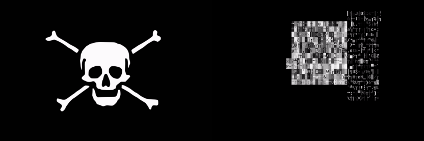
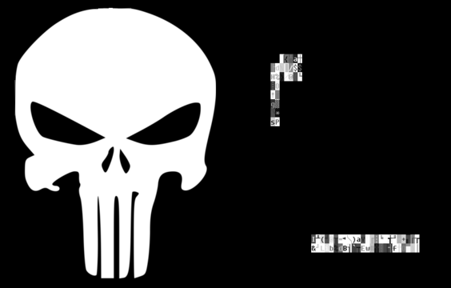

# geneti-scii

ASCII/Unicode image generator with three step [genetic algorithm](https://en.wikipedia.org/wiki/Genetic_algorithm).

<p align="center">
    
    <p style="text-align:center">Input image by <a href="https://commons.wikimedia.org/wiki/File:Pirate_Flag_of_John_Taylor.svg">RootOfAllLight</a>, CC0, via Wikimedia Commons</p>
</p>

<p align="center">
    
    <p style="text-align:center">Input image by <a href="https://commons.wikimedia.org/wiki/File:The-punisher-logo-png-transparent.png">keyword</a>, <a href="https://creativecommons.org/licenses/by-sa/4.0">CC BY-SA 4.0</a>, via Wikimedia Commons</p>
</p>

## Useful links:

- [Genetic Programming: Evolution of Mona Lisa](https://rogerjohansson.blog/2008/12/07/genetic-programming-evolution-of-mona-lisa/)
- [Gynvael's Livestream #28: Mona Lisa genetycznie](https://www.youtube.com/watch?v=7zI7M_5_jBE)

## Requirements

```bash
python3 -m venv venv
source venv/bin/activate
pip install -r requirements.txt
```

## ImageMagic cheatsheet:

Reduced just enough so as to best fit into the given size
```bash
convert input.jpg -resize 400x400 output.jpg
```

For new size (ignore aspect ratio)
```bash
convert input.jpg -resize 400x400\! output.jpg
```

Change RGB to grayscale
```bash
convert input.jpg -set colorspace Gray -separate -average output.jpg
```

Convert JPEG format to PNG
```bash
convert input.jpg output.png
```